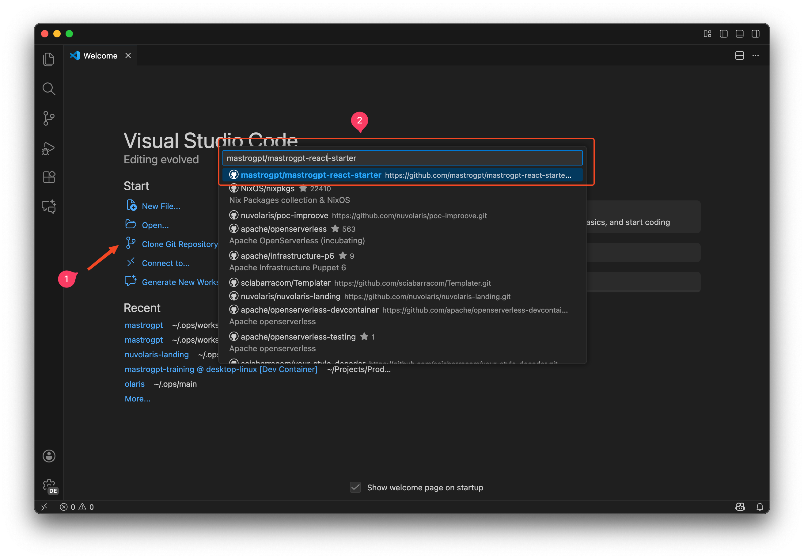
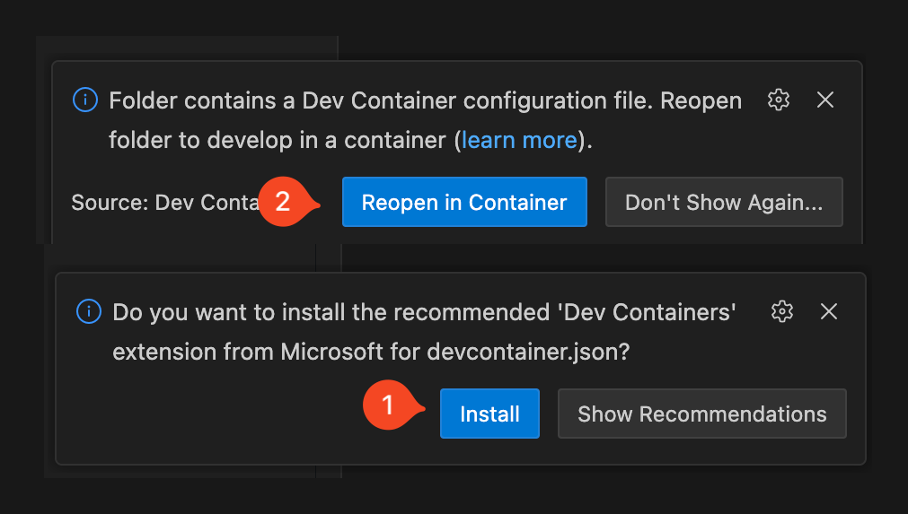
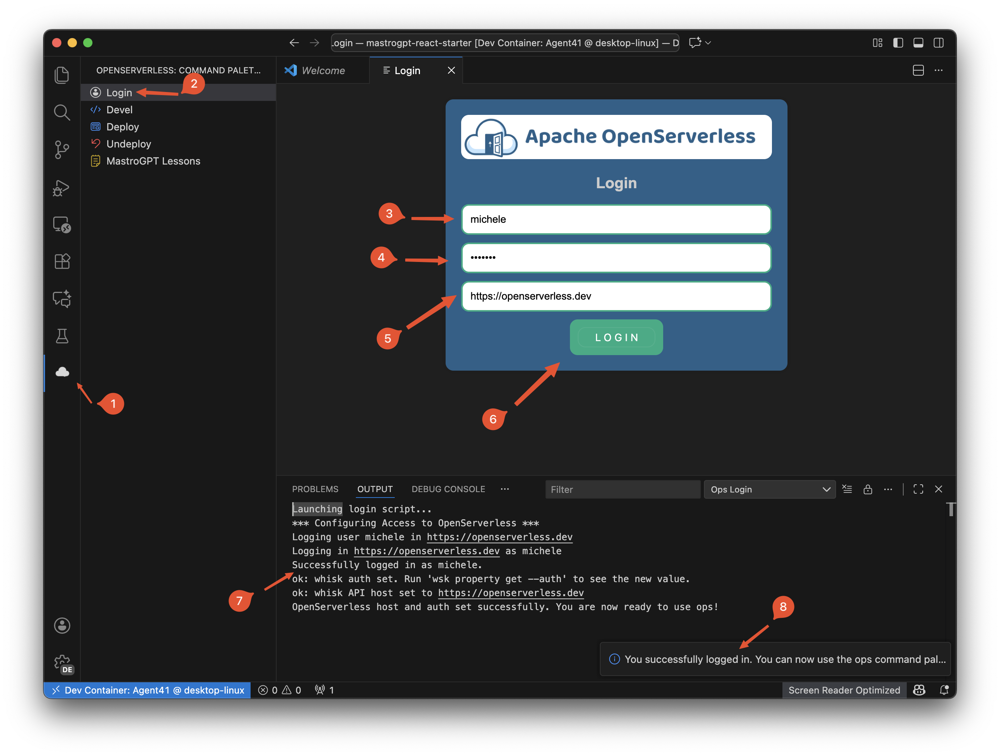
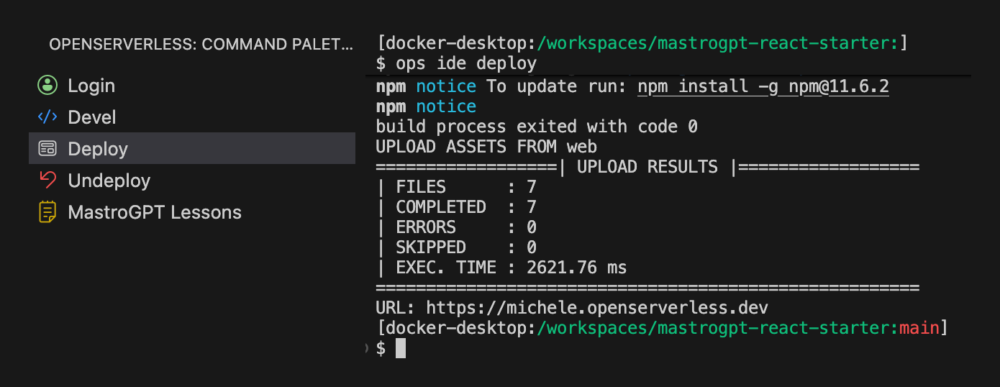
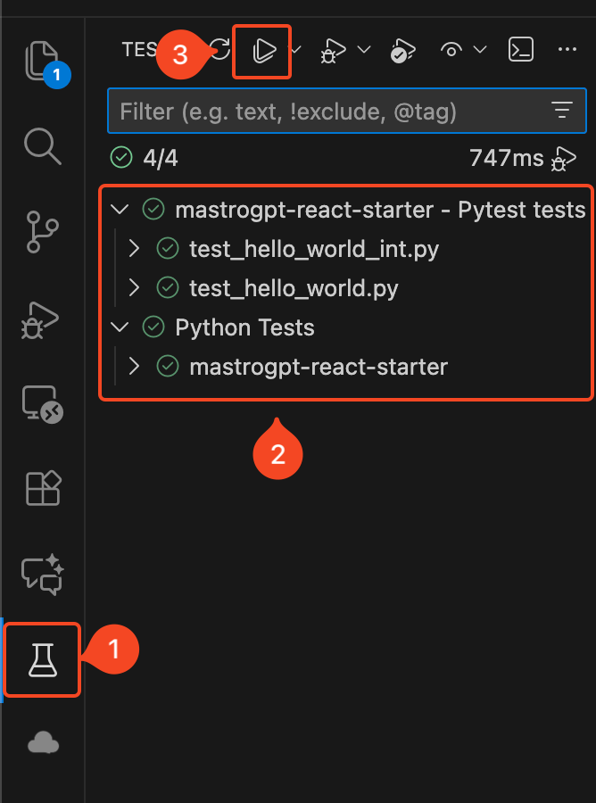
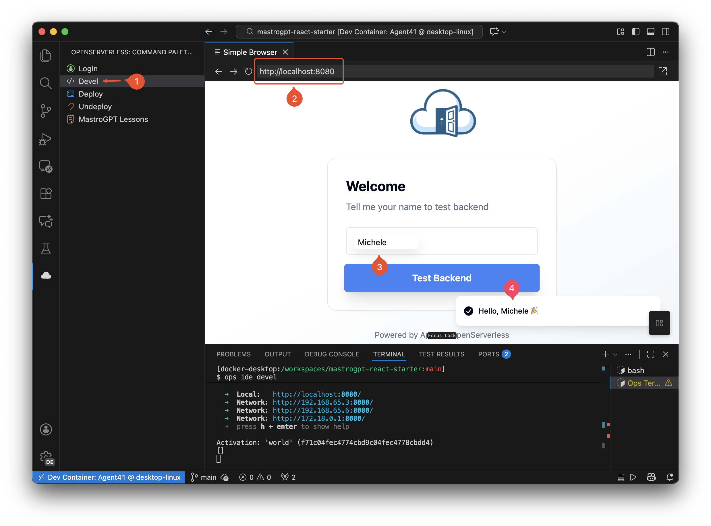
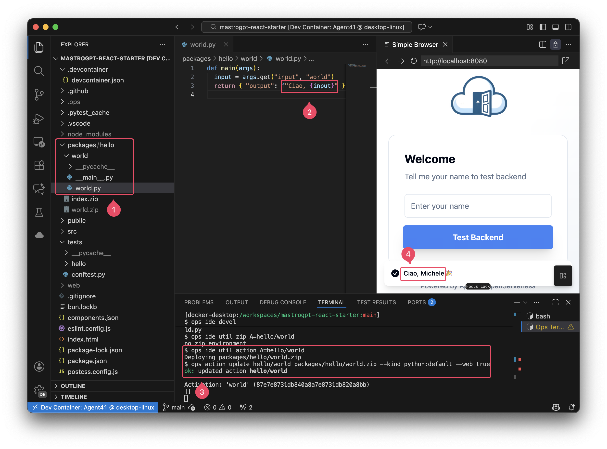
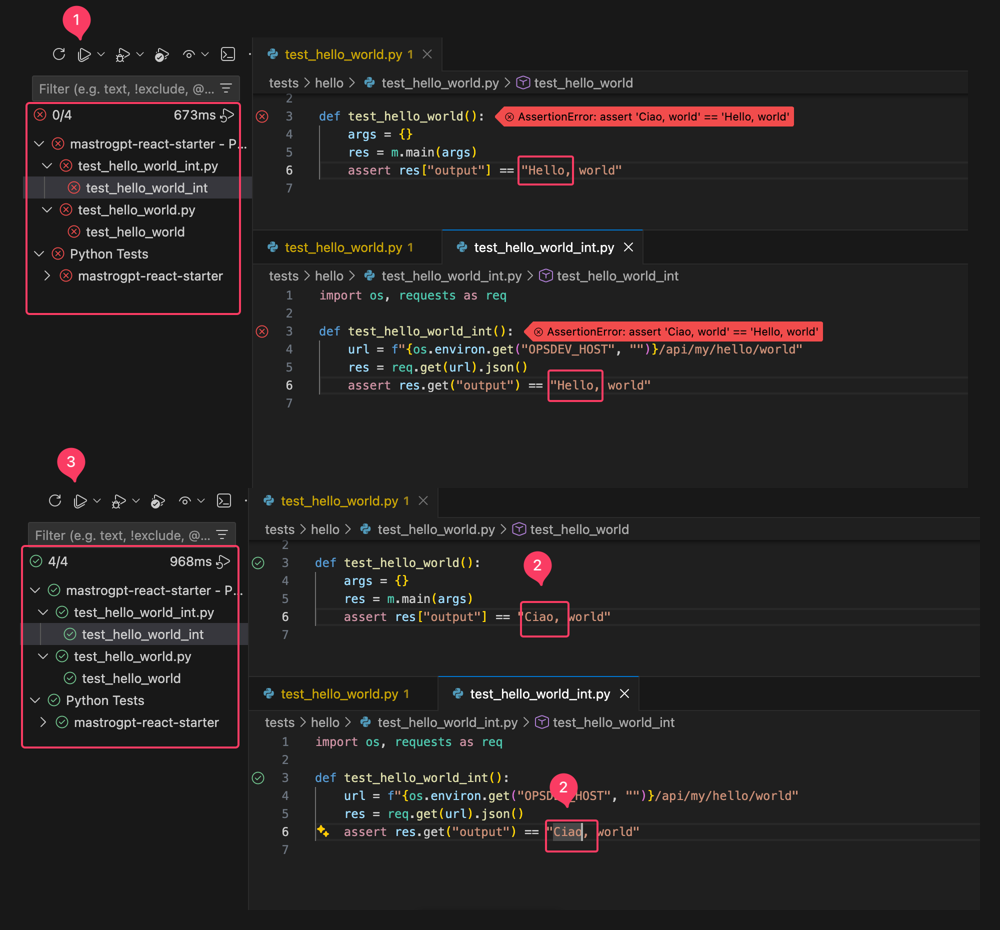
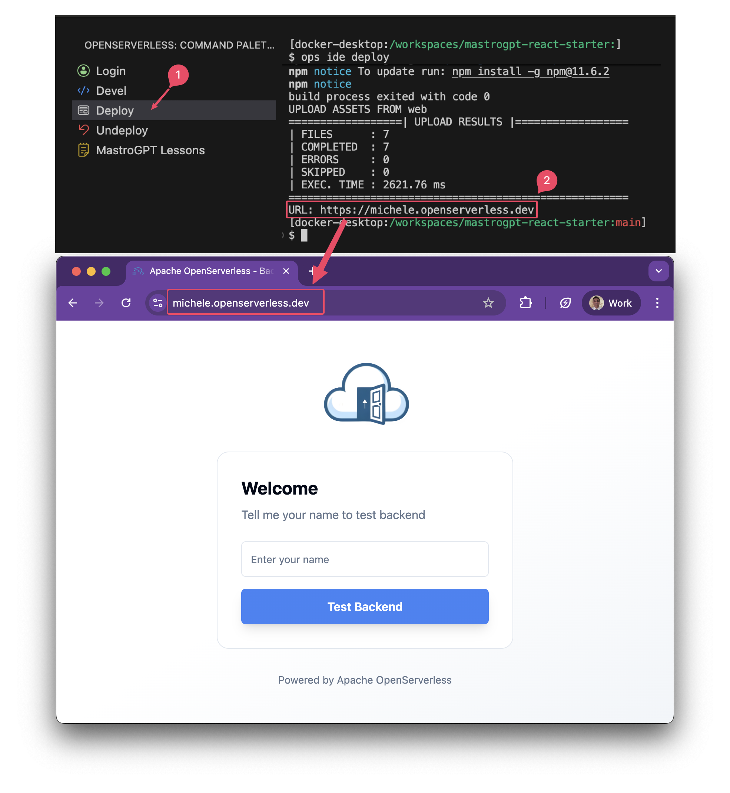

# Accesso allo starter kit react di Nuvolaris



Lo screenshot illustra la procedura standard per clonare un repository Git remoto utilizzando l’interfaccia grafica di Visual Studio Code. Di seguito sono descritti i passaggi rappresentati, con tono formale e professionale.

### 1. Avvio della funzione “Clone Git Repository”
Nel pannello iniziale di Visual Studio Code, collocato nella parte sinistra dell’interfaccia, l’utente seleziona l’opzione **“Clone Git Repository…”**.
Questa funzione consente di avviare il processo di clonazione di un repository remoto, senza necessità di utilizzare comandi da terminale.

### 2. Inserimento o selezione del repository
Dopo aver selezionato l’opzione di clonazione, Visual Studio Code apre una barra di ricerca nella parte superiore dello schermo.

L’utente inserisce il nome o l’URL del repository desiderato, in questo caso: `mastrogpimg/mastrogpt-react-starter`
Contestualmente, l’editor mostra un elenco di repository corrispondenti o recentemente utilizzati.
Il repository corretto viene evidenziato e selezionato dall’elenco:
```
mastrogpimg/mastrogpt-react-starter
```

Questa conferma indica che l’utente intende clonare tale progetto dalla piattaforma GitHub.

### 3. Passaggi successivi (non mostrati nello screenshot)
Una volta selezionato il repository, Visual Studio Code procederà con i seguenti passaggi:

1. Richiedere all’utente la **cartella di destinazione** in cui salvare i file del progetto.
2. Eseguire la **clonazione completa** del repository remoto nella posizione scelta.
3. Proporre l’apertura del progetto appena clonato in una **nuova finestra** o nella finestra corrente.


### Finalità della procedura
Questa operazione consente di importare rapidamente un progetto GitHub all’interno dell’ambiente di sviluppo, rendendo immediatamente disponibile il codice sorgente per la modifica, l’esecuzione e la gestione con gli strumenti integrati di Visual Studio Code.


# Attivare il DevContainer in Visual Studio Code



Lo screenshot mostra due notifiche di Visual Studio Code relative alla gestione di un progetto che include una configurazione per **Dev Containers**. Le notifiche guidano l’utente nell’installazione dell’estensione necessaria e nella successiva apertura del progetto all’interno del container di sviluppo.

### 1. Installazione dell’estensione “Dev Containers” (etichetta 1)

La prima notifica informa l’utente che il progetto include un file `devcontainer.json`.
Per poter utilizzare questa configurazione, Visual Studio Code richiede l’installazione dell’estensione ufficiale:

- **Dev Containers (Microsoft)**

Il pulsante evidenziato con l’etichetta **1 – “Install”** consente di installare immediatamente l’estensione necessaria.
L’installazione è obbligatoria per abilitare tutte le funzionalità di sviluppo all’interno di un container Docker dedicato.

### 2. Riapertura del progetto nel Dev Container (etichetta 2)

Una volta rilevata la presenza di una configurazione Dev Container, Visual Studio Code suggerisce all’utente di riaprire il progetto direttamente all’interno del container.

La seconda notifica indica:

- “Folder contains a Dev Container configuration file. Reopen folder to develop in a container.”

Il pulsante marcato con l’etichetta **2 – “Reopen in Container”** avvia il processo di:

1. Creazione del container sulla base della configurazione fornita.
2. Installazione automatica degli strumenti di sviluppo previsti.
3. Apertura del progetto all’interno dell’ambiente isolato.

Questo consente di lavorare in un ambiente di sviluppo standardizzato, riproducibile e separato dal sistema operativo locale.

### Funzione complessiva delle notifiche

Le due notifiche operano in sequenza per garantire la corretta attivazione del Dev Container:

1. **Installare l’estensione richiesta.**
2. **Riaprire il progetto all’interno del container configurato.**

Questo processo assicura che il progetto utilizzi un ambiente di sviluppo coerente con quanto definito nel repository.

# Procedura di login all’ambiente OpenServerless




Lo screenshot mostra Visual Studio Code aperto all’interno di un Dev Container, mentre viene eseguita la procedura di autenticazione a un ambiente **Apache OpenServerless** tramite l’estensione dedicata.
Gli elementi numerati rappresentano i passaggi logici e funzionali dell’intero processo.

### 1. Apertura del pannello dell’estensione (etichetta 1)
Nel pannello laterale di sinistra è visibile l’icona dell’estensione OpenServerless.
Selezionandola, VS Code mostra tutte le azioni disponibili, come Login, Deploy, Undeploy.


### 2. Avvio del comando “Login” (etichetta 2)
Dal menu dell’estensione viene scelto il comando **Login**.
Questa azione avvia la procedura guidata di autenticazione, visualizzata come interfaccia grafica al centro dello schermo.

### 3. Inserimento del nome utente (etichetta 3)
Nel primo campo del modulo di login viene inserito il nome utente.
Nell’esempio mostrato, l’utente utilizza la credenziale: `michele`


### 4. Inserimento della password (etichetta 4)
Nel secondo campo viene digitata la password associata all’account OpenServerless.
Il valore è mascherato, come previsto da una procedura di accesso sicura.

### 5. Inserimento dell’host OpenServerless (etichetta 5)
Nel terzo campo viene specificato l’indirizzo dell’istanza OpenServerless alla quale collegarsi.
Nell’immagine il valore inserito è:

```
httpsimg//openserverless.dev
```


### 6. Conferma dell’operazione tramite il pulsante LOGIN (etichetta 6)
L’utente completa il modulo selezionando il pulsante **LOGIN**.
Questa azione avvia la procedura di connessione e configurazione dell’ambiente.

### 7. Visualizzazione del log operativo (etichetta 7)
Nel pannello **OUTPUT**, VS Code mostra l’intero processo eseguito dall’estensione:

- avvio dello script di login;
- configurazione dell’accesso all’host;
- utilizzo delle credenziali fornite;
- conferma dell’autenticazione avvenuta con successo;
- aggiornamento dei parametri dell’ambiente `whisk` (host e auth).

Il testo indica chiaramente che l’utente è stato autenticato correttamente.

### 8. Messaggio di conferma dell’avvenuto login (etichetta 8)

Infine, Visual Studio Code mostra una notifica di esito positivo:

> *You successfully logged in. You can now use the ops command palette.*

Ciò conferma che l’ambiente OpenServerless è configurato e pronto per operazioni come deploy, undeploy e gestione delle funzioni.

### Sintesi della procedura
L’immagine illustra l’intero flusso di autenticazione tramite interfaccia grafica:

1. apertura dell’estensione
2. avvio del comando di login
3. compilazione del modulo
4. conferma
5. visualizzazione dell’esito positivo

Il sistema risulta ora correttamente configurato per operazioni con Apache OpenServerless all’interno del Dev Container.

# Procedura di deploy tramite `ops` in Visual Studio Code



Lo screenshot mostra l’esecuzione del comando **Deploy** dell’estensione OpenServerless all’interno di un Dev Container in Visual Studio Code.
A sinistra è visibile il menu dei comandi, mentre a destra è riportato l’output della procedura di deployment.


### 1. Selezione del comando “Deploy”
Nel pannello laterale dell’estensione OpenServerless, l’utente seleziona la voce **Deploy**.
Questa operazione avvia il processo automatizzato che:

- compila il progetto,
- genera gli asset da distribuire,
- carica i file sull’istanza OpenServerless configurata.

### 2. Esecuzione del comando `ops ide deploy`
Il terminale integrato mostra che Visual Studio Code ha eseguito:

```
ops ide deploy
```

Si tratta del comando che gestisce l’intero ciclo di build e upload del progetto verso l’ambiente remoto.

### 3. Completamento della fase di build
Il sistema conferma che il processo di compilazione è terminato correttamente:

### 4. Caricamento degli asset (UPLOAD RESULTS)
Segue il riepilogo dell’upload.
Il report indica che:

- sono stati caricati 7 file,
- il caricamento è stato eseguito con successo,
- non sono stati rilevati errori,
- nessun file è stato ignorato.

### 5. URL di pubblicazione
A operazione conclusa, viene restituito l’indirizzo pubblico del progetto:
```
URL: httpsimg//michele.openserverless.dev
```

L’applicazione risultante è quindi online e raggiungibile all’URL indicato.

---

### Sintesi della procedura
Il deploy è stato eseguito correttamente e senza errori.
Il progetto React è stato compilato, i file generati sono stati caricati sull’istanza OpenServerless, e l’applicazione risulta ora pubblicata e accessibile tramite l’URL fornito.

# Esecuzione dei test Python in Visual Studio Code



Lo screenshot mostra la schermata di Visual Studio Code dedicata all’esecuzione dei test Python tramite il pannello **Testing**.
Gli elementi numerati illustrano i passaggi necessari per visualizzare, organizzare ed eseguire i test presenti nel progetto.

### 1. Apertura del pannello “Testing” (etichetta 1)
Nel pannello laterale sinistro è selezionata l’icona a forma di beuta (simbolo dei test).
Questa icona apre il **Test Explorer**, lo strumento integrato in Visual Studio Code per la gestione dei test automatici.

### 2. Elenco dei test individuati (etichetta 2)
Il riquadro centrale mostra la lista dei test rilevati automaticamente dal sistema.
In questo caso, il rilevatore ha identificato:

- un gruppo di test Pytest associati al progetto `mastrogpt-react-starter`;
- due file di test Python:
  - `test_hello_world_int.py`
  - `test_hello_world.py`
- il gruppo “Python Tests”, che rappresenta l’insieme aggregato dei test Python disponibili.

Tutti i test risultano eseguiti correttamente, come indicato dai simboli verdi di completamento.

### 3. Avvio dell’esecuzione dei test (etichetta 3)
Nella barra superiore del Test Explorer è presente l’icona **Run All Tests** (triangolo “play”).
La selezione di questo pulsante consente di eseguire:

- l’intera suite di test,
- tutti i test presenti nel progetto,
- aggiornando i risultati mostrati nel pannello.

Nello screenshot, il riquadro in alto indica che sono stati eseguiti 4 test in totale, senza errori, con un tempo di esecuzione di 747 ms.

### Funzione complessiva della procedura
L’immagine rappresenta l’intero flusso operativo per:

1. accedere al pannello dei test,
2. visualizzare la lista dei test Python trovati automaticamente,
3. eseguire la suite tramite l’apposito comando.

Tutti i test risultano completati con successo, confermando il corretto funzionamento dell’ambiente di sviluppo e della configurazione Pytest.

# Esecuzione dell’applicazione in modalità di sviluppo (“Devel”)



Lo screenshot mostra l’utilizzo della funzione **Devel** dell’estensione OpenServerless in Visual Studio Code, utile per testare l’applicazione localmente durante la fase di sviluppo.

---

### 1. Avvio della modalità di sviluppo (etichetta 1)
Nel pannello laterale di sinistra viene selezionato il comando **Devel**.
Questo comando esegue:

- l’avvio del backend OpenServerless in locale,
- la generazione di un server di sviluppo per il frontend,
- la pubblicazione degli endpoint di test accessibili sul browser.

Nel terminale, il comando eseguito è:

```
ops ide devel
```


### 2. Apertura del browser integrato (etichetta 2)
La pagina viene caricata nel **Simple Browser** di Visual Studio Code, indirizzata all’endpoint locale:

`httpimg//localhost:8080`

Si tratta dell’indirizzo generato dal server di sviluppo, elencato anche nel terminale:

`Local: httpimg//localhost:808img/`


### 3. Esecuzione della richiesta verso il backend (etichetta 3)
L’interfaccia dell’applicazione richiede all’utente di inserire un nome.
Una volta digitato “Michele”, viene premuto il pulsante **Test Backend**.

In questo momento, il frontend invia una richiesta HTTP al backend OpenServerless attivo in locale.


### 4. Risposta restituita dal backend (etichetta 4)
L’applicazione mostra una notifica:

```
Hello, Michele 🎉
```

Questo indica che:

- il backend OpenServerless ha ricevuto correttamente la richiesta,
- la funzione serverless è stata eseguita,
- la risposta è stata gestita correttamente dal frontend,
- la modalità di sviluppo è operativa e sincronizzata.

Nel terminale, la sezione finale mostra anche l’attivazione della funzione:

```
Activation: ‘world’ (…)
```


### Sintesi operativa della modalità “Devel”

1. Avvio del backend e server di sviluppo con **Devel**.
2. Apertura automatica dell’applicazione su `localhost:8080`.
3. Interazione con il frontend tramite il browser integrato.
4. Verifica immediata della risposta della funzione backend.

Questa modalità consente uno sviluppo rapido e interattivo, effettuando un deploy continuo e incrementale durante la fase di sviluppo del backend, ed eseguendo il frontend localmente anche esso in modalita sviluppo.

# Modifica dell’azione backend e aggiornamento tramite OpenServerless



Lo screenshot documenta l’intero ciclo di modifica, aggiornamento e verifica di una funzione backend in un progetto OpenServerless all’interno di Visual Studio Code, eseguito nel Dev Container.


### 1. Identificazione della funzione da modificare (etichetta 1)
Nel pannello **EXPLORER** è selezionata la cartella: `packageimg/hellimg/worlimg/`

Questa cartella contiene la definizione dell’azione OpenServerless denominata `hellimg/world`.
In particolare, il file interessato è: `world.py`

Il contenuto di questo file rappresenta il codice eseguito dal backend quando l’azione viene invocata.

### 2. Modifica della logica della funzione (etichetta 2)
All’interno di `world.py` viene modificata la risposta della funzione Python:

```python
def main(args):
    input = args.get("input", "world")
    return { "output": f"Ciao, {input}" }
```

La modifica consiste nel personalizzare il messaggio di risposta, che ora restituisce:

```
Ciao, <nome>
```

Si tratta della logica che verrà eseguita dal backend quando il frontend invia una richiesta.

3. Aggiornamento dell’azione su OpenServerless (etichetta 3)

Nel terminale vengono eseguiti gli aggiornamenti dell'azione.

L’output conferma l’operazione:

```
ok: updated action hellimg/world
```

Segno che l’azione è stata aggiornata ed è immediatamente invocabile.

4. Verifica della modifica tramite il frontend (etichetta 4)

Nel Simple Browser di Visual Studio Code, l’utente inserisce il nome (“Michele”) e seleziona Test Backend.

La risposta mostrata è:

```
Ciao, Michele 🎉
```

Questo messaggio dimostra che:

- il backend esegue la versione aggiornata della funzione,
- la modifica al file Python è stata correttamente pacchettizzata e applicata,
- frontend e backend comunicano correttamente nella modalità di sviluppo.


### Sintesi della procedura

L’immagine rappresenta l’intero ciclo operativo di sviluppo backend:

1.	apertura del file dell’azione,
2.	modifica del codice Python,
3.	creazione del pacchetto ZIP,
4.	aggiornamento dell’azione OpenServerless tramite ops,
5.	verifica immediata nel browser integrato.

Questa sequenza consente uno sviluppo veloce e iterativo delle funzioni serverless direttamente da Visual Studio Code.


# Aggiornamento dei test dopo la modifica della funzione backend



Lo screenshot mostra come l’aggiornamento della funzione backend (“Hello → Ciao”) comporti un necessario aggiornamento dei test, sia locali (unit test) sia remoti (integration test).
L’immagine illustra il ciclo completo: fallimento dei test, modifica delle asserzioni, nuova esecuzione con esito positivo.


## 1. Fallimento iniziale dei test (etichetta 1)

Nella parte superiore della schermata, il **Test Explorer** indica: `img/4 FAILED`

Ciò significa che **tutti i test sono falliti**.

Aprendo i file dei test (`test_hello_world.py` e `test_hello_world_int.py`) si osservano gli errori:

- Il test locale e il test di integrazione si aspettavano: `“Hello, world”`
ma la funzione ora restituisce: `“Ciao, world”`

Entrambi i test falliscono con errore di tipo `AssertionError`.


## 2. Aggiornamento delle asserzioni dei test (etichetta 2)

Per allineare i test al nuovo comportamento della funzione, le asserzioni di entramnbi i test aggiornate.

Da: `"Hello, world"` a  `"Ciao, world"`

3. Nuova esecuzione e superamento dei test (etichetta 3)

Dopo la modifica, i test vengono rieseguiti con il pulsante Run All Tests.

Il nuovo risultato mostra: `img/4 ✓ PASSED`

Il simbolo verde conferma che:
-	la funzione Python restituisce l’output previsto,
-	il backend aggiornato risponde correttamente,
-	i test unitari e di integrazione ora sono coerenti con il comportamento attuale.


### Sintesi dell’intero flusso
1.	Modifica della funzione backend (da “Hello” a “Ciao”).
2.	Fallimento dei test, perché verificavano ancora il vecchio comportamento.
3.	Aggiornamento delle aspettative nei test (assert == "Ciao, world").
4.	Riesecuzione e superamento di tutti i test (img/4).

Questo screenshot mostra un caso reale in cui l’aggiornamento del codice richiede la sincronizzazione dei test per garantire coerenza e qualità del sistema.


# Pubblicazione dell’applicazione e apertura dell’URL deployato



Lo screenshot mostra il processo completo di deploy dell’applicazione tramite OpenServerless e la successiva apertura dell’applicazione pubblicata attraverso l’URL fornito dall’ambiente di deployment.


### 1. Esecuzione del comando “Deploy” (etichetta 1)

Nel pannello laterale dell’estensione OpenServerless, viene selezionata l’opzione **Deploy**.

Questa operazione avvia il comando:

`ops ide deploy`

Il comando si occupa di:

- compilare il progetto frontend,
- preparare gli asset da pubblicare,
- caricare i file sull’host OpenServerless,
- rendere disponibile l'applicazione tramite un dominio pubblico.

Nell’area del terminale si osserva che il processo termina correttamente.

Al termine dell’upload, OpenServerless fornisce l’URL pubblico dove l’applicazione è ora raggiungibile:

```
URL: httpsimg//michele.openserverless.dev
```

Questo dominio rappresenta l’endpoint pubblico associato al progetto, configurato automaticamente durante il deploy.


### 3. Apertura dell’applicazione pubblicata

La seconda parte dello screenshot mostra il browser con il sito aperto all’indirizzo indicato.

Questo dominio rappresenta l’endpoint pubblico associato al progetto, configurato automaticamente durante il deploy.

L’URL viene evidenziato e utilizzato per aprire l’applicazione.

L’interfaccia visualizzata corrisponde all’app React deployata.

La presenza dell’interfaccia conferma che:

- il deploy è avvenuto correttamente,
- gli asset statici sono stati caricati con successo,
- il dominio pubblico è attivo e raggiungibile.


### Sintesi della procedura

1. **Selezione del comando Deploy** dall’estensione OpenServerless.
2. **Esecuzione del processo di build e upload** senza errori.
3. **Ricezione dell’URL pubblico** dell'applicazione.
4. **Apertura del sito nel browser**, che conferma il deploy riuscito.

L’immagine documenta chiaramente il flusso completo di pubblicazione e verifica finale dell'applicazione su OpenServerless.
